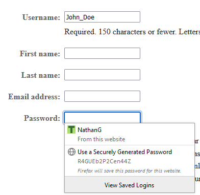
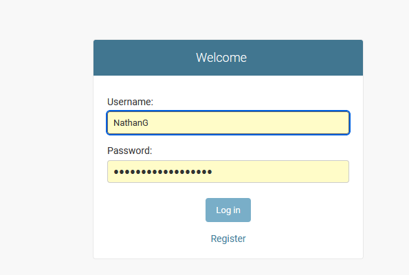

# Homework 5 - Uryyb Greb


## x) Read and summarize (This subtask x does not require tests with a computer. Some bullets per article is enough for your summary, feel free to write more if you like)

### € Schneier 2015: Applied Cryptography: 10. Using Algorigthms: 10.1, 10.2, 10.3, 10.4 (from start until the start of "Dereferencing Keys" in 10.4)

## y) Choose a password manager. Explain: (This subtask y does not require tests with a computer if the question can be answered without them)
Firefox Password Manager

### What treaths does it protect against?
- Credential stuffing attack (Password reuse)
- Weak password (Generates strong password)
- Phishing attack (Prevent entering credentials on phishing sites)
- Keylogging (Automatic password filling)

### What information is encrypted, what's not?
Every information is encrypted with a primary password **if one is provided**, otherwise nothing is encrypted and access to the browser means access to the passwords.

### What's the license? How would you describe license's effects or categorize it?
MPL, Flexible licensing with authorization to redistribute under compatible licences. Open source (use, modify, redistribute under conditions)

### Where is the data stored? If in "the cloud", which country / juristiction / which companies? If on local disk, where?
Data is stored on the disk in %APPDATA%/Mozilla/Firefox/Profiles/logins.json

The logins are stored in the json file in the following form:
```json
{
  "nextId": 82,
  "logins": [
    {
      "id": 1,
      "hostname": "https://aai-logon.hes-so.ch",
      "httpRealm": null,
      "formSubmitURL": "https://aai-logon.hes-so.ch",
      "usernameField": "j_username",
      "passwordField": "j_password",
      "encryptedUsername": "...",
      "encryptedPassword": "...",
      "guid": "{b2017ec1-a8e9-452c-b056-2147a2155822}",
      "encType": 1,
      "timeCreated": 1600159087496,
      "timeLastUsed": 1636442872303,
      "timePasswordChanged": 1633949089100,
      "timesUsed": 358
    },
    {
      "id": 2,
      "hostname": "https://leetcode.com",
      "httpRealm": null,
      "formSubmitURL": "https://leetcode.com",
      "usernameField": "login",
      "passwordField": "password",
      "encryptedUsername": "...",
      "encryptedPassword": "...",
      "guid": "{ab56e486-c70a-4a53-b8e4-7d0a3080c9bb}",
      "encType": 1,
      "timeCreated": 1610484738506,
      "timeLastUsed": 1610484738506,
      "timePasswordChanged": 1610484738506,
      "timesUsed": 1
    }
    ]
}
```

### How is the data protected?
256-bit AES encryption

Sources [https://support.mozilla.org/en-US/kb/how-firefox-securely-saves-passwords](https://support.mozilla.org/en-US/kb/how-firefox-securely-saves-passwords)

## a) Demonstrate the use of a password manager.
1. Start Mozilla Firefox.
2. Enter about:logins in the search bar.
3. You have access to the built-in password manager.
4. Go to **...** and options or about:preferences#privacy
5. Tick 'Use a Primary Password'.
6. Choose a strong primary password and remember it. Do not write it down.
7. Firefox will prompt you to generate a strong password when creating account and save them. 
8. Firefoy will mark the logins for you in yellow fields when on a login page 
9. Access all your credentials in about:logins

## b) Encrypt and decrypt a message (you can use any tool you want, gpg is one option)
We will use [OpenSSL](https://www.openssl.org/).
1. Generate a private key
```shell
openssl genrsa -out private-key.pem 2048
```
2. Extract the public key
```shell
openssl rsa -in private-key.pem -pubout -out public-key.pem
```
3. Write your top secret message
```shell
echo "1. Whisk the flour and eggs. 2. Gradually add the milk and water. 3. Scoop the batter onto a hot griddle. 4. Cook until lightly browned on the bottom. 5. Flip and continue cooking until done on both sides. " > msg.txt
```
4. Encrypt the message with the public key
```shell
openssl rsautl -encrypt -pubin -inkey public-key.pem -in msg.txt -out encrypted.bin
```
5. Send the encrypted.bin file to a recipient (your lover, for example)
6. Your recipient will have to use the private key to decrypt the messsage
```shell
openssl rsautl -decrypt -inkey private-key.pem -in encrypted.bin -out decrypted.txt
cat decrypted.txt
```